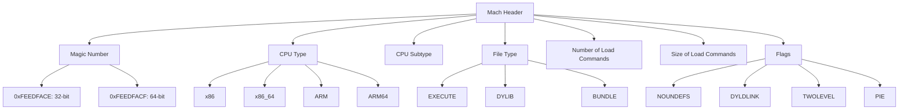
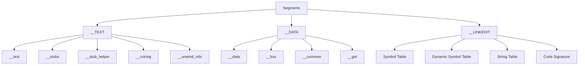
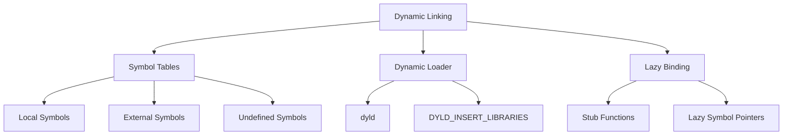
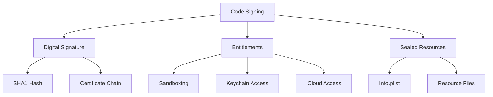
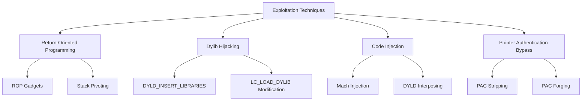
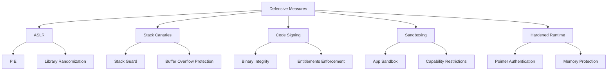
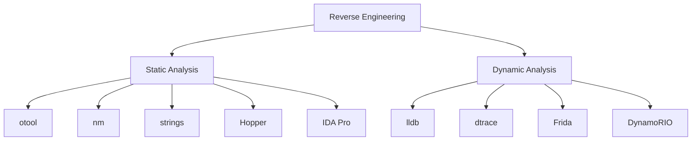

# Mach-O Deep Dive: A Cybersecurity Perspective

## Table of Contents
1. [Introduction](#introduction)
2. [Mach-O File Structure](#mach-o-file-structure)
3. [Header Analysis](#header-analysis)
4. [Load Commands in Detail](#load-commands-in-detail)
5. [Segments and Sections](#segments-and-sections)
6. [Dynamic Linking and Symbol Tables](#dynamic-linking-and-symbol-tables)
7. [Code Signing and Security](#code-signing-and-security)
8. [Exploitation Techniques](#exploitation-techniques)
9. [Defensive Measures](#defensive-measures)
10. [Reverse Engineering Mach-O](#reverse-engineering-mach-o)

## 1. Introduction

Mach-O (Mach Object) is the file format for executables, object code, shared libraries, and core dumps in macOS and iOS. For cybersecurity professionals, understanding Mach-O is crucial for various tasks including malware analysis, reverse engineering, and secure software development.

## 2. Mach-O File Structure

Let's start with a comprehensive overview of the Mach-O structure:

```mermaid
graph TD
    A[Mach-O File] --> B[Mach Header]
    A --> C[Load Commands]
    A --> D[Segments]
    D --> E[__TEXT]
    D --> F[__DATA]
    D --> G[__LINKEDIT]
    D --> H[Custom Segments]
    A --> I[Raw Data]
    
    B --> B1[Magic Number]
    B --> B2[CPU Type]
    B --> B3[File Type]
    B --> B4[Number of Load Commands]
    
    C --> C1[LC_SEGMENT/_64]
    C --> C2[LC_SYMTAB]
    C --> C3[LC_DYSYMTAB]
    C --> C4[LC_LOAD_DYLINKER]
    C --> C5[LC_UUID]
    C --> C6[LC_VERSION_MIN_MACOSX]
    C --> C7[LC_SOURCE_VERSION]
    C --> C8[LC_MAIN]
    C --> C9[LC_ENCRYPTION_INFO]
    
    E --> E1[__text]
    E --> E2[__stubs]
    E --> E3[__stub_helper]
    E --> E4[__cstring]
    E --> E5[__unwind_info]
    
    F --> F1[__data]
    F --> F2[__bss]
    F --> F3[__common]
    F --> F4[__dyld]
    
    G --> G1[Symbol Table]
    G --> G2[String Table]
    G --> G3[Code Signature]
```

This diagram provides a detailed view of a Mach-O file's structure, including specific load commands and sections that are particularly relevant for security analysis.

## 3. Header Analysis

The Mach header is crucial for initial file analysis:

Key points for cybersecurity:
- The magic number helps identify the architecture (32-bit vs 64-bit).
- CPU type and subtype are crucial for understanding the target environment.
- File type indicates the purpose of the Mach-O file (executable, library, etc.).
- Flags can reveal important characteristics like Position Independent Execution (PIE).

## 4. Load Commands in Detail

Load commands are essential for understanding how the binary will be loaded and executed:

```mermaid
graph TD
    A[Load Commands] --> B[LC_SEGMENT/_64]
    A --> C[LC_SYMTAB]
    A --> D[LC_DYSYMTAB]
    A --> E[LC_LOAD_DYLIB]
    A --> F[LC_MAIN]
    A --> G[LC_CODE_SIGNATURE]
    
    B --> B1[Virtual Address]
    B --> B2[Virtual Size]
    B --> B3[File Offset]
    B --> B4[File Size]
    
    C --> C1[Symbol Table Offset]
    C --> C2[Number of Symbols]
    C --> C3[String Table Offset]
    
    D --> D1[Local Symbols]
    D --> D2[External Symbols]
    D --> D3[Undefined Symbols]
    
    E --> E1[Library Name]
    E --> E2[Time Stamp]
    E --> E3[Current Version]
    E --> E4[Compatibility Version]
    
    F --> F1[Entry Point]
    F --> F2[Stack Size]
    
    G --> G1[Data Offset]
    G --> G2[Data Size]
```

Security implications:
- LC_SEGMENT/_64 defines memory layout, crucial for understanding potential memory corruption vulnerabilities.
- LC_SYMTAB and LC_DYSYMTAB are essential for reverse engineering and identifying interesting functions.
- LC_LOAD_DYLIB can reveal dependencies and potential attack vectors through library hijacking.
- LC_MAIN specifies the entry point, important for debugging and analysis.
- LC_CODE_SIGNATURE is crucial for verifying the integrity of the binary.

## 5. Segments and Sections

Segments and sections organize the binary's code and data:

Security considerations:
- __TEXT segment is typically read-only, containing executable code and constants.
- __DATA segment contains writable data, potential target for data corruption attacks.
- __LINKEDIT contains metadata for dynamic linking, important for understanding the binary's external dependencies.

## 6. Dynamic Linking and Symbol Tables

Understanding dynamic linking is crucial for analyzing potential vulnerabilities:

Security implications:
- Symbol tables are crucial for reverse engineering and identifying interesting functions.
- The dynamic loader (dyld) can be manipulated for attacks like library injection.
- Lazy binding can be exploited for function hooking and code injection.

## 7. Code Signing and Security

Code signing is a critical security feature in macOS:

Security considerations:
- Code signing helps prevent unauthorized modifications to the binary.
- Entitlements define the app's capabilities and are crucial for security analysis.
- Sealed resources ensure the integrity of the application bundle.

## 8. Exploitation Techniques

Common exploitation techniques targeting Mach-O binaries:

## 9. Defensive Measures

Key defensive techniques for Mach-O binaries:

## 10. Reverse Engineering Mach-O

Tools and techniques for reverse engineering Mach-O binaries:

Key points:
- Static analysis tools help understand the structure and content of the binary without execution.
- Dynamic analysis tools allow for runtime inspection and manipulation of the binary.
- A combination of both approaches is often necessary for comprehensive analysis.